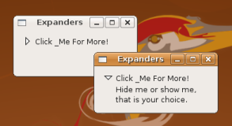

## 容器控件

### 扩展器

Gtk::Expander 容器只能有一个子类。这个子类可以显示或者隐藏。你可以通过点击扩展器文本左边的三角形来显示或者隐藏子类。上图显示了点击前喝点击后的两种状态。

	#!/usr/bin/env ruby
	require 'gtk2'
	
	window = Gtk::Window.new
	window.set_border_width 10
	window.set_size_request 200, -1
	window.set_title "Expanders"
	
	window.signal_connect('delete_event') { false }
	window.signal_connect('destroy') { Gtk.main_quit }
	
	expander = Gtk::Expander.new "Click _Me For More!"
	label = Gtk::Label.new "Hide me or show me,\nthat is your choice."
	expander.add label
	
	# make the child (label) visible
	expander.expanded = true
	
	window.add expander
	window.show_all
	Gtk.main