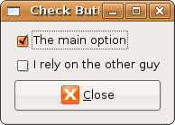

## 按钮和开关

### 多选按钮

如果不是第一次阅读，请直接跳到页面的结尾。

+ 使用通用项
+ 再次看看回调和事件处理

### 多选按钮

在之前开关按钮一节提到过， Gtk::CheckButton 是从 Gtk::ToggleButton 派生出来的，所以它继承了开关按钮的所有功能。下面的例子并没有什么新东西，除了提到了通用项。这还是介绍 Ruby 里面的信号和事件处理机制的好例子。我们先来看看这段代码：

	#!/usr/bin/env ruby
	
	require 'gtk2'
	def set_reset_check2(w, chk2)
	  # Gtk::Widget#sensitive=boolean |or #set_sensitive(boolean)
	  chk2.sensitive = w.active? ? true : false
	end
	
	window = Gtk::Window.new(Gtk::Window::TOPLEVEL)
	window.set_title  "Check Buttons"
	window.border_width = 10
	window.signal_connect('delete_event') { Gtk.main_quit }
	
	vbox = Gtk::VBox.new(false, 5)
	check1 = Gtk::CheckButton.new("The main option")
	check2 = Gtk::CheckButton.new("I rely on the other guy")
	close  = Gtk::Button.new(Gtk::Stock::CLOSE)
	
	check2.sensitive = false
	check1.signal_connect( "toggled" ) { |w| set_reset_check2(w, check2) }
	close.signal_connect('clicked') { Gtk.main_quit }
	
	vbox.pack_start(check1, false, true, 0)
	vbox.pack_start(check2, false, true, 0)
	vbox.pack_start(close,  false, true, 0)
	
	window.add(vbox)
	window.show_all
	Gtk.main

### 使用通用项

通用项代表一些普遍使用的菜单或者工具，比如说 打开或者退出。它们通常是一个图片或者文本，你可以在 Gtk::Stock 模块文档中找到其它通用项。

在 Ruby 里面，创建包含通用项的按钮很容易。你只需要在创建按钮的时候传一个 Gtk::Stock 类型作为参数就可以了。我们的例子中就是创建了一个关闭按钮（close = Gtk::Button.new(Gtk::Stock::CLOSE)）。

### 回调和事件处理－回调闭包

对于熟悉 C 版本的 Gtk+ 的读者来说，你或许想知道在 Ruby 里面如何实现下面的代码：

	g_signal_connect_swapped(G_OBJECT(button), "clicked",
	                         G_CALLBACK(gtk_widget_destroy),
	                         (gpointer) window);
	                         	
之所以迷惑是因为上述 C 调用的 swap 功能。也就是，按钮的回调是窗口的自我替换。不仅仅是按钮，连同它所在的窗口也会被删除。如果你仔细分析我们上面的代码，你会发现下面代码和这个很相似：

	check1.signal_connect( "toggled" ) { |w| set_reset_check2(w, check2) }

当信号出现并被 check1 控件（第一个多选按钮）捕获时，它改变了第二个按钮－下面的控件或者说下面的多选按钮（check2）的状态。这的确是一个替换，但是回调怎么知道第二个控件呢？当很显然，两个控件都作为参数传递的。对 Ruby 或者闭包机制不熟悉的人可能会觉得 check2 就像一个全局变量，因此在代码块里面可见。然而，事实上并不是这样的。Ruby 的回调是闭包，闭包继承了调用者的环境并保留了一份拷贝。要真正了解这一点，你需要学习一下闭包，但是只是为了理解这个例子，你简单地认为 check2 是一个全局变量也可以，尽管他并不是全局变量。