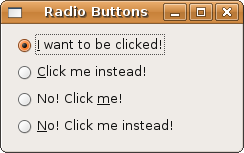

### 按钮和开关

### 单选按钮

现在你已经知道 Gtk::RadioButton 也是 Gtk::ToggleButton 派生出来的，所以它继承了 Gtk::ToggleButton 的所以功能。单选按钮是组合在一起的开关。因为它们是相互排斥的，所以同时只能选中或者激活一个。一旦选中一个，其它的就会被变为为选中状态。尽管它们通常不需要绑定点击事件，你还是可以根据需要绑定一个。同一组内的每个单选按钮都会绑定一个 toggled 信号，当选中一个时，只有两个按钮会触发 toggled 信号，也就是之前选中的和刚刚选中的。如果你打算捕获 toggled 信号，你必须把同一组内的所有单选按钮都绑定这个信号。在下面的例子当中，你可以看到即使你不做任何处理，这些单选按钮都可以正常工作。

	#!/usr/bin/env ruby
	
	require 'gtk2'
	
	window = Gtk::Window.new(Gtk::Window::TOPLEVEL)
	window.set_title  "Radio Buttons"
	window.border_width = 10
	window.signal_connect('delete_event') { Gtk.main_quit }
	
	radio1 = Gtk::RadioButton.new("_I want to be clicked!")
	radio2 = Gtk::RadioButton.new(radio1, "_Click me instead!")
	radio3 = Gtk::RadioButton.new(radio1, "No! Click _me!")
	radio4 = Gtk::RadioButton.new(radio1, "_No! Click me instead!")
	
	vbox = Gtk::VBox.new(false, 5)
	vbox.pack_start(radio1, false, true, 0)
	vbox.pack_start(radio2, false, true, 0)
	vbox.pack_start(radio3, false, true, 0)
	vbox.pack_start(radio4, false, true, 0)
	
	window.add(vbox)
	window.show_all
	Gtk.main