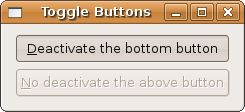
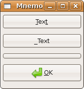

## 开关按钮

+ 助记符

### 开关按钮

开关按钮控件一种按钮。点击之后，它会保持住激活或者未激活的状态。激活状态看上去是按钮按下的样子。点击激活的开关会让它恢复到正常状态（按钮未按下的状态）。从列表上可以看出状态时控件的一个属性，因此它是由 Gtk::Widget#sensitive 控制的。你可以通过 "Gtk::ToggleButton#active?" 来查询一个控件对象的状态。现在就很清楚了，因为开关按钮从控件继承状态，所以处理控件的状态（你可以在 Gtk 文档的 GtkWidgetFlags 下找到）要格外小心。

开关按钮中派生出两个控件：多选按钮和单选按钮

	#!/usr/bin/env ruby
	
	require 'gtk2'
	def toggle_em(w, other_tgg)
	  # Gtk::Widget#sensitive=boolean |or #set_sensitive(boolean)
	  other_tgg.sensitive = w.active? ? false : true
	end
	
	window = Gtk::Window.new(Gtk::Window::TOPLEVEL)
	window.set_title  "Toggle Buttons"
	window.border_width = 10
	window.signal_connect('delete_event') { Gtk.main_quit }
	
	vbox = Gtk::VBox.new(true, 5)
	toggle1 = Gtk::ToggleButton.new("_Deactivate the bottom button")
	toggle2 = Gtk::ToggleButton.new("_No deactivate the above button")
	
	toggle1.signal_connect( "toggled" ) { |w| toggle_em(w, toggle2) }
	toggle2.signal_connect( "toggled" ) { |w| toggle_em(w, toggle1) }
	
	vbox.pack_start_defaults(toggle1)
	vbox.pack_start_defaults(toggle2)
	
	window.add(vbox)
	window.show_all
	Gtk.main

### 助记符

现在关注一下第一幅图片中窗口里带下划线的字母。这是在按钮里面普遍有的附加功能，所谓的“助记符”。助记符是一些只要按下，就会触发特定操作的按键的集合。在我们这里，当用户同时按下 Alt 和带下标的字母的按键，比如 Alt+D 或者 <Alt>+<D> 会有点击上面的按钮一样的效果，同理，<Alt>+<N> 会触发下面的按钮（当然，这要按钮激活以响应键盘或者鼠标活动才行）。

在 Ruby Gtk 程序中，助记符是通过使用 Gtk::Button.new 实例化时在按钮的文本中添加下划线自动完成的。

#### 下面是一个同日版的教程里面类似的例子：

需要注意下面的第一个按钮有两个助记符，第二个按钮是痛哟布尔值 false 来禁用助记符的。

	#!/usr/bin/env ruby
	
	require 'gtk2'
	
	window = Gtk::Window.new
	window.title = "Mnemonics and stock"
	window.signal_connect("delete_event") {Gtk::main_quit}
	window.signal_connect("destroy") {Gtk::main_quit}
	
	box = Gtk::VBox.new(false, 0)
	window.add(box)
	
	button = Gtk::Button.new("_Tex_t")
	button.signal_connect("activate") do
	 	puts "activated"
	end
	box.pack_start(button, false, false, 5)
	
	button = Gtk::Button.new("_Text", false)
	box.pack_start(button, false, false, 5)
	
	count = 0
	button = Gtk::Button.new
	button.signal_connect("clicked") do |b|
		b.label = "#{count} times"
		count += 1
	end
	box.pack_start(button, false, false, 5)
	
	button = Gtk::Button.new(Gtk::Stock::OK)
	box.pack_start(button, false, false, 5)
	
	window.show_all
	Gtk.main	