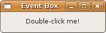

## 容器控件

### 事件盒子

包括 Gtk::Label 在内的很多控件都不响应 GDK 事件，因为它们没有自己的 Gdk::Window 。为了改变这种状况，GTK+ 引入了 Gtk::EventBox 容器控件。Gtk::EventBox 给不能捕获 GDK 事件的子类提供了捕获 GDK 事件的能力。Gtk::EventBox 代表子类来完成这件事情，注意这是 GDK 而不是 GTK 信号！

事件盒子通过给对象提供一个 Gdk::Window 来实现子类控件的事件捕获。不像 C 版本的 GTK+, Ruby 里面建立 GDK 事件/信号捕获机制，不是使用 signal_connect 语法。它通过 Gdk::Window#events= 或者 Gdk::Window#set_events(或者 Gtk::Widget#events= 或者 Gtk::Widget#set_events) 来把一个事件添加到事件盒子来创建事件。

你必须在调用 Gtk::Widget#realize（比如：eventbox.realize） 之前调用 Gtk::Didget#set_events 。然而，如果控件（eventbox）已经调用过 Gtk::Widget#realize，你需要使用 Gtk::Widget#add_events 来添加事件。调用 Gtk::Widget#realize 之前，你的事件盒子（eventbox = Gtk::EventBox.new） 没有 Gdk::Window 或者其它 GDK 控件资源和它关联。通常，实现是发生在父类调用实现时，但是事件盒子是一个例外。当你在控件上面调用 Gtk::Window#show_all 时，会被 GTK+ 自动实现化，但是这时候事件盒子并没有实现，因为它们还是不可见的。这时候只要调用 Gtk::Widget#realize 就可以解决这个问题了。

当你准备实现事件盒子时，你要确保它已经被添加到顶级控件的子类中，不然，他就无效了。因为当你实现一个控件时，它会自动实现它的祖先，如果没有祖先，GTK+ 就会实现失败。

	window.add(eventbox)
	eventbox.realize

事件盒子实现后，就会有一个关联的 Gdk::Window。不像 Gtk::Window 作为一个有装饰的顶层窗口，Gdk::Window 表示屏幕上一个控件被绘制的矩形区域。一个 Gtk::Window 会包含很多个 Gdk::Window 对象，分别对应每一个子控件。

这里还要提到另外一个问题。在我们的范例程序中，我们使得 Gtk::Label 控件可点击，也就是说，当光标移到文本上面改变其显示样式。这是通过 Gdk::Window#cursor= 或者 Gdk::Window#set_cursor 实现的。

	eventbox.window.cursor = Gdk::Cursor.new(Gdk::Cursor::HAND1)

这里我们深入挖掘一下。上面代码片段中 window 属性是哪里来的？这里，很显然，我们的 Gtk::EventBox 有一个叫做 window 的方法会返回 Gdk::Window 实例。虽然我们只能猜测它内部是如何实现的，但是在 GDK 对象上面设置 cursor 是安全的，以后，不要忘记看看 Gdk::Cursor 的内容。

	#!/usr/bin/env ruby
	require 'gtk2'
	
	def change_label(event, label)
	  if event.event_type == Gdk::Event::BUTTON2_PRESS
	    if label.text[0].chr == 'D'
	      label.text = "I Was Double-Clicked!"
	    else
	      label.text = "Double-Click Me Again!"
	    end
	  end
	end
	window = Gtk::Window.new(Gtk::Window::TOPLEVEL)
	
	window.set_title  "Event Box"
	window.border_width = 10
	window.set_size_request(200, -1)
	# The delete_event is only needed if you plan to
	# intercept the destroy / quit with a dialog box.
	#
	# window.signal_connect('delete_event') { false }
	window.signal_connect('destroy') { Gtk.main_quit }
	
	eventbox = Gtk::EventBox.new
	label    = Gtk::Label.new('Double-click me!')
	
	# eventbox.set_events(Gdk::Event::BUTTON_PRESS_MASK)
	eventbox.events = Gdk::Event::BUTTON_PRESS_MASK
	
	eventbox.add(label)
	window.add(eventbox)
	
	### You need to call #realize only after you add it to the
	### top (including) widget.
	eventbox.realize
	### Only after the EventBox eventbox is realized it will
	### have an associated Gdk::Window (see: "window" below)
	# eventbox.window.set_cursor(Gdk::Cursor.new(Gdk::Cursor::HAND1))
	eventbox.window.cursor = Gdk::Cursor.new(Gdk::Cursor::HAND1)
	
	eventbox.signal_connect('button_press_event') { |w, e| change_label(e, label) }
	
	window.show_all
	Gtk.main

#### GdkEventMask

一系列位标志，用来表明一个窗口可以接受哪些事件。大多数的标记是下面的一个或者多个 GdkEventType 的集合。Gdk::Event::POINTER_MOTION_HINT_MASK 是一个特殊的标记，用来减少 Gdk::Event::MOTION_NOTIFY 接受的事件的数量。通常，每次鼠标移动时，可以接受一个 Gdk::Event::MOTION_NOTIFY 事件。如果一个应用程序在事件处理时花了很多时间，鼠标移动就会出现明显的延迟。当使用 Gdk::Event::POINTER_MOTION_HINT_MASK 标志时，服务器一次只会发送一个 Gdk::Event::MOTION_NOTIFY 事件，除非应用程序通过调用 Gdk::Window#pointer 显式地要求更多事件。

+ EXPOSURE_MASK
+ POINTER_MOTION_MASK
+ POINTER_MOTION_HINT_MASK
+ BUTTON_MOTION_MASK
+ BUTTON1_MOTION_MASK
+ BUTTON2_MOTION_MASK
+ BUTTON3_MOTION_MASK
+ BUTTON_PRESS_MASK
+ BUTTON_RELEASE_MASK
+ KEY_PRESS_MASK
+ KEY_RELEASE_MASK
+ ENTER_NOTIFY_MASK
+ LEAVE_NOTIFY_MASK
+ FOCUS_CHANGE_MASK
+ STRUCTURE_MASK
+ PROPERTY_CHANGE_MASK
+ VISIBILITY_NOTIFY_MASK
+ PROXIMITY_IN_MASK
+ PROXIMITY_OUT_MASK
+ SUBSTRUCTURE_MASK
+ SCROLL_MASK
+ ALL_EVENTS_MASK - 以上所有信号的总和
