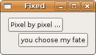
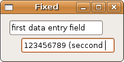
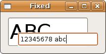

## 容器控件

### 固定的容器

Gtk::Fixed 控件是一种可以按照像素坐标来放置子控件的布局容器。除非你有很好的使用场景，否则你永远不知道在某些用户设置或者GUI系统上控件会怎么渲染。

首先我们来看一个简单的实现两个按钮的程序，然后再看另外两个例子体验一下有可能出错的场景。

	#!/usr/bin/env ruby
	require 'gtk2'
	
	window = Gtk::Window.new
	window.set_border_width 10
	window.set_title "Fixed"
	window.signal_connect('delete_event') { false }
	window.signal_connect('destroy') { Gtk.main_quit }
	
	fixed = Gtk::Fixed.new
	
	# Currently you can not change font on arbitrary
	# widgets, like the button here. But it does work
	# with Gtk::Label widgets.
	#
	# I wished to show the disadvantage of using Gtk::Fixed, 
	# with the original example from Krause's GTK+ book,
	# using buttons, however, as explained above in order to
	# demonstrate that disadvantage I had to bypass the font
	# problem with buttons by changing the top button to Label.
	# Hence if you change the buttons to Labels or to some other
	# editable widget the font experiment will work!
	#
	# label1 = Gtk::Label.new "Pixel by pixel ..."
	# label2 = Gtk::Label.new "you choose my fate"
	
	button1 = Gtk::Button.new "Pixel by pixel ..."
	button2 = Gtk::Button.new "you choose my fate"
	
	button1.signal_connect('destroy') { Gtk.main_quit }
	button2.signal_connect('destroy') { Gtk.main_quit }
	
	fixed.put button1, 0, 0
	fixed.put button2, 20, 30
	
	window.add fixed
	window.show_all
	Gtk.main

### 固定容器的不足

#### 第一个例子

如果你仔细看了之前这个例子里面的注释部分，你就会知道目前的 Ruby Gtk+ 实现在处理控件上面的文字时时有一些问题，而不是可编辑控件。这就是为什么我在上面的程序中使用输入字段而不是按钮的原因。我想说的是如果你不关注细节比如说字体大小的话，Gtk::Fixed 会给你带来一些麻烦。这里有一个使用普通字体的例子：

	#!/usr/bin/env ruby
	require 'gtk2'
	
	window = Gtk::Window.new
	window.set_border_width 10
	window.set_title "Fixed"
	
	window.signal_connect('delete_event') { false }
	window.signal_connect('destroy') { Gtk.main_quit }
	
	fixed = Gtk::Fixed.new
	field1 = Gtk::Entry.new
	field2 = Gtk::Entry.new
	
	fixed.put field1, 0, 0
	fixed.put field2, 20, 30
	
	window.add fixed
	window.show_all
	Gtk.main

#### 第二个例子

下面就是第二个使用不同字体大小的例子。当然，你应该仔细对照这两个图形。

	#!/usr/bin/env ruby
	require 'gtk2'
	
	window = Gtk::Window.new
	window.set_border_width 10
	window.set_title "Fixed"
	
	window.signal_connect('delete_event') { false }
	window.signal_connect('destroy') { Gtk.main_quit }
	
	fixed = Gtk::Fixed.new
	field1 = Gtk::Entry.new
	field2 = Gtk::Entry.new
	
	font_desc = Pango::FontDescription.new "Sans 30"
	field1.modify_font font_desc
	
	fixed.put field1, 0, 0
	fixed.put field2, 20, 30
	
	window.add fixed
	window.show_all
	Gtk.main

	