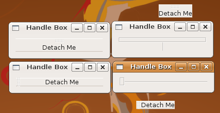

## 容器控件

### 处理盒子

Gtk::HandleBox 控件是一种 Gtk::Bin 容器（你只要记得 Gtk::Bin 只能有一个子类就够了），它允许子类能够通过鼠标拖拽的方式来从父类窗口分离。一个子类放在自己的窗口里面没有其他装饰。如果移除的处理盒子所在的窗口中有其他控件，它们会自动扩大来填充满额外的空间。这个控件通常用于工具条和其它工具包对象。事实上，你可以把控件拖回原位置来重新绑定。你要仔细才能定位到把手。

	#!/usr/bin/env ruby
	require 'gtk2'
	
	window = Gtk::Window.new
	window.border_width = 10
	window.set_size_request(200, -1)
	window.title = "Handle Box"
	
	# The delete_event is only needed if you plan to
	# intercept the destroy / quit with a dialog box.
	#
	# window.signal_connect('delete_event') { false }
	window.signal_connect('destroy') { Gtk.main_quit }
	
	handle = Gtk::HandleBox.new
	label = Gtk::Label.new("Detach Me");
	
	# Add a shadow to the handle box, set the handle position
	# on the left and set the snap edge to the top of the widget.
	
	handle.shadow_type = Gtk::SHADOW_IN
	handle.handle_position = Gtk::POS_TOP
	# handle.handle_position = Gtk::POS_LEFT
	handle.snap_edge = Gtk::POS_TOP
	handle.add(label)
	
	window.add(handle)
	window.show_all
	Gtk.main

+ GtkShadowType

  用来改变边框的外观，一般由 Gtk::Frame 提供。
  
    + SHADOW_NONE － 没有边框
    + SHADOW_IN - 斜向内边框
    + SHADOW_OUT - 像一个按钮，斜向外边框
    + SHADOW_ETCHED_IN - 边框本身是向内斜
    + SHADOW_ETCHED_OUT - 边框本身是向外斜
    
+ GtkPositionType

  描述了一个控件特定功能的的位置，比如说 Gtk::Notebook 的标签, Gtk::HandleBox 的把手或者 Gtk::Scale 的文本。
  
    + POS_LEFT 功能在控件左边缘
    + POS_RIGHT 功能在控件右边缘
    + POS_TOP 功能在控件上边缘
    + POS_BOTTOM 功能在控件下边缘 

