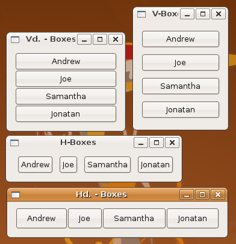

## 水平和垂直的盒子

Gtk::Box 是抽象基类，它包含了子孙中需要的所有属性和行为。也就是说，水平和垂直盒子类 Gtk::HBox 和 Gtk::VBox 分别仅仅是提供了创建该控件的功能。

	#!/usr/bin/env ruby
	
	require 'gtk2'
	
	window = Gtk::Window.new
	window.border_width = 10
	window.set_size_request(150, -1)
	window.title = "Vd. - Boxes"
	
	window.signal_connect('delete_event') { false }
	window.signal_connect('destroy') { Gtk.main_quit }
	
	labels = %w[Andrew Joe Samantha Jonatan]
	
	            # homogeneous, spacing
	vbox = Gtk::VBox.new(false, 0)
	
	labels.each do |name|
	  btt = Gtk::Button.new(name)
	  btt.signal_connect("clicked") {btt.destroy}
	  vbox.pack_start_defaults(btt) 
	end
	
	window.add(vbox)
	window.show_all
	Gtk.main

除了它们一个创建垂直盒子，一个创建水平盒子以外，我们需要关注的主要区别是它们打包按钮的方式。

一种方式是默认的三个参数，也就是一个接着一个（这里指按钮：

+ expand = true; 值为 true 表示创建新子类时，空间会从其它子类中平均减去。
+ fill = true; 值为 true 表示分配给子类的空间时真正分配给了子类，而不是仅仅用空白填充在其周围。当 expand 是 false 时候，这个参数没有影响。
+ padding = 0; 这个数字表示附加值子类之间和周围的额外空间大小。

Gtk::Box 抽象类里面还提供了另外四个包装的实例方法：

	Gtk::Box#pack_start(child, expand = true, fill = true, padding = 0)
	Gtk::Box#pack_end(child, expand = true, fill = true, padding = 0)
	Gtk::Box#pack_end_defaults(child)
	Gtk::Box#pack_start_defaults(child)
	
上述赋值均表示默认值。

为了保持完整，我们来看看上述例子的一个变种－－这次水平的按钮明确指定了 expand, fill 和 padding 参数。

	#!/usr/bin/env ruby
	
	require 'gtk2'
	
	window = Gtk::Window.new
	window.border_width = 10
	window.set_size_request(150, -1)
	window.title = "H-Boxes"
	
	window.signal_connect('delete_event') { false }
	window.signal_connect('destroy') { Gtk.main_quit }
	
	labels = %w[Andrew Joe Samantha Jonatan]
	
	           # homogeneous, spacing
	hbox = Gtk::HBox.new(false, 0)
	
	labels.each do |name|
	  btt = Gtk::Button.new(name)
	  btt.signal_connect("clicked") {btt.destroy}
	
	              # child, expand, fill, padding
	  hbox.pack_start(btt, false, false, 5)
	end
	
	window.add(hbox)
	window.show_all
	Gtk.main

### Gtk::Box 功能（行为）

+ pack_start(child, expand = true, fill = true, padding = 0) 给盒子添加子类，在盒子的开头添加控件，这个子类会被添加到其它添加到盒子开头的子类之后。
+ pack_end(child, expand = true, fill = true, padding = 0) 给盒子添加子类，在盒子的末尾添加控件。这个子类会被添加到其它添加到盒子末尾的子类之后。
+ pack_start_defaults(widget) 给盒子添加控件，在盒子的开头添加。这个子类会被添加到其它任何被添加到盒子开头的子类之后。而对于添加子控件的参数， expand, fill 和 padding 分别被设置为 true, true 和 0。
+ pack_end_defaults(widget) 给盒子添加控件，在盒子的末尾添加。这个子类会被添加到其它添加到盒子末尾的控件之后。而对于添加子控件的参数，expand, fill 和 padding 分别被设置为 true, true 和 0。
+ homogeneous? 返回这个盒子是不是 homogeneous 的（ 所有的子类都是同样大小）。
+ homogeneous=(homogeneous) 设置 Gtk::Box 的 homogeneous 值，控制子类是不是一样大小。
+ set_homogeneous(homogeneous) 同 Gtk::Box#homogeneous= 一样。
+ spacing 返回盒子的间隔大小。
+ spacing=(spacing) 设置 Gtk::Box 的间隔大小，表示盒子子控件之间的间隔。
+ set_spacing(spacing) 和 Gtk::Box#spacing= 一样。
+ reorder_child(child, position) 把子类移到盒子中子类列表的某个位置。这个列表指 Gtk::Box 的子类，不仅包含 Gtk::PACK_START 添加的，也包含 Gtk::PACK_END 添加的，并且按照这些控件被添加的顺序排列。一个子控件在盒子的子类列表里面的位置是它被添加进去的顺序。一个子控件的位置会排在其它按照同类方式添加的在子类列表里面排在它前面的控件之后。
+ query_child_packing(child) 返回子类是如何被添加到盒子里面的信息。
+ set_child_packing(child, expand, fill, padding, pack_type) 设置子类添加到盒子里面的方式
+ ref_accessible 查看 Atk::Implementor#ref_accessible。
+ add_child - 查看 Gtk::Buildable#add_child.
+ construct_child - 查看 Gtk::Buildable#construct_child.
+ get_internal_child - 查看 Gtk::Buildable#get_internal_child.
＋ name - 查看 Gtk::Buildable#name.
＋ name= - 查看 Gtk::Buildable#name=.
＋ set_buildable_property - 查看Gtk::Buildable#set_buildable_property.
＋ set_name - 查看 Gtk::Buildable#set_name.	

### 属性

+ homogeneous ＝ false; true 或者 false － 表示子类是不是相同大小
+ spacing：整型，子类之间的间隔大小

### 子类属性

+ expand： true 或者 false; (默认为 true) － 表示子类是不是会随着父类变大而变大。
+ fill: true 或者 false;(默认为 true) - 表示空间是给子类自己还是用把空间填充在控件周围。
+ pack-type: （默认是 Gtk::PACK_START） － 一个 Gtk#PackType 表示是添加在父类开头还是末尾。
+ padding: 整型 － 用像素表示添加在子控件之间和周围的额外空间。
+ position: 整型 － 子类在父类列表中的位置。