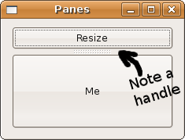

## 水平和垂直面板

Gtk::Paned 是派生出水平和垂直面板类 Gtk::HPaned 和 Gtk::VPaned 的抽象基类。它是一种特殊的容器控件，只包含两个子控件。两个控件之间有尺寸调整器，它可以让用户通过拖拽调整器来调整子控件的大小。不管是程序还是用户移动调整器，一个控件缩小必定伴随着另一个控件变大。就像盒子一样，这个水平或者垂直面板类都只是用来创建控件。因为 Gtk::Paned 类只有这两个类，GTK+ 提供了包装任何子类的功能。现在我们来自己瞧瞧这个功能：

+ add1(child) － 用默认参数在面板的上部或者左部添加子类，这相当于 Gtk::Paned#pack1(child, false, true)。
+ add2(child) - 用默认参数在面板的下部或者右部添加子类，这相当于 Gtk::Paned#pack2(child, false, true)。
＋ pack1(child, resize, shrink) - 在面板的上部或者左部添加子类，这里的 child 表示要添加的子类， resize 为 true 表示当面板控件大小改变时，子控件也相应变化，shrink 为 true 表示它的大小可以小于给予它的空间。
+ pack2(child, resize, shrink)

最好还是来看个实际的例子：

	#!/usr/bin/env ruby
	
	require 'gtk2'
	
	window = Gtk::Window.new(Gtk::Window::TOPLEVEL)
	window.set_title  "Panes"
	window.border_width = 10
	window.set_size_request(225, 150)
	window.signal_connect('delete_event') { Gtk.main_quit }
	
	button1 = Gtk::Button.new("Resize")
	button2 = Gtk::Button.new("Me")
	
	button1.signal_connect( "clicked" ) { window.destroy }
	button2.signal_connect( "clicked" ) { window.destroy }
	
	paned = Gtk::VPaned.new
	paned.add1(button1)
	paned.add2(button2)
	
	window.add(paned)
	window.show_all
	Gtk.main

等你学完记事本控件，你会看到更多关于面板控件的例子。