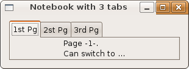
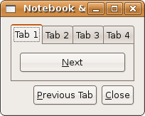
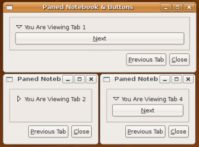

## 容器控件

### 记事本

Gtk::Notebook 控件把子控件一页一页来组织。用户可以通过切换控件某个特定边缘的标签来切换不同的页面。你可以指定这些标签的位置（查看：Gtk PositionType）。一旦创建了记事本，你只能给它前面或者后面添加标签。

	append_page(child, tab_label = nil)
	prepend_page(child, tab_label = nil)

注意，标签文本并不一定是一种 Gtk::Label。比如说你可以把一个包含一个文本和一个关闭按钮的 Gtk::HBox 放到标签上。这样就可以让你使用其它控件，比如说按钮或者图片作为标签的文本。

每个记事本页面都可以显示一个子控件。然而，因为这个子控件可以是另外的容器，所以每页一个子控件的这个限制是很表面的。

如需知道更详细的信息，请参照 [Gtk::Notebook]() 文档。

	#!/usr/bin/env ruby
	require 'gtk2'
	
	def another_tab; puts "Switching"; end
	def report_press(w); puts "Somebody pressed gumbek (button) w=#{w}"; end
	
	window = Gtk::Window.new(Gtk::Window::TOPLEVEL)
	window.set_title  "Notebook with 3 tabs"
	window.border_width = 10
	window.set_size_request(300, -1)
	# The delete_event is only needed if you plan to
	# intercept the destroy / quit with a dialog box.
	#
	# window.signal_connect('delete_event') { false }
	# Normally you'd catch the destroy signal, however
	# as the following code shows delete-event can do
	# anything you want also quit for that matter:
	# window.signal_connect('destroy') { Gtk.main_quit }
	window.signal_connect('delete_event') { Gtk.main_quit }
	
	nb = Gtk::Notebook.new
	label1 = Gtk::Label.new("1st Pg")
	label2 = Gtk::Label.new("2st Pg")
	label3 = Gtk::Label.new("3rd Pg")
	note1  = Gtk::Label.new("Page -1-.\nCan switch to ...")
	note2  = Gtk::Label.new("-2- page.\nSwitch to ...")
	button = Gtk::Button.new("Gumbek")
	
	# In Ruby Notebook works without {{ signal_connect }}.
	# -----------------------------------------------------------------------
	# In Ruby the following doesn't work (Label does not respond to 'clicked'
	# note1.signal_connect('clicked') { another_tab }
	# note2.signal_connect('clicked') { another_tab }
	
	# However you can place a button into a notebook and klick away.
	button.signal_connect( "clicked" ) {|w| report_press(w) }
	
	nb.signal_connect('change-current-page') { another_tab }
	
	nb.append_page(note1, label1)
	nb.append_page(note2, label2)
	nb.append_page(button,  label3)
	
	window.add(nb)
	window.show_all
	Gtk.main

GtkPositionType

  描述了一个控件特定功能的的位置，比如说 Gtk::Notebook 的标签, Gtk::HandleBox 的把手或者 Gtk::Scale 的文本。
  
    + POS_LEFT 功能在控件左边缘
    + POS_RIGHT 功能在控件右边缘
    + POS_TOP 功能在控件上边缘
    + POS_BOTTOM 功能在控件下边缘 

### 测试你的理解

在 Andrew 的书《Foundations of GTK+ Development》里面，每一个章节的最后，都有一个叫做“测试你的理解”的段落，这是用来鼓励读者测试它的知识的地方。在容器控件最后，有两个练习非常符合我们教程的主旨。也就是说，这需要你理解了我们这里大部分讲的内容。尽管我们还有一个章节要学习，我还是希望能够能够介绍一下之前提到的两个例子。Andrew Klause 用下面这段话来介绍这些例子：这一章介绍了很多 GTK＋ 里面的容器控件，下面的两个练习会带你练习你说学到的一些控件。

#### 使用多个容器

容器的一个重要的特性是每个容器都可以包含其它容器。这个例子里，你会用到很多容器。主窗口显示了了一个 Gtk::Notebook 和底部的两个按钮。

这个记事本有四个页面，每个页面都包含了一个 Gtk::Button，用来切换到下一个页面，最后从最后一个页面切换到第一个页面。

下面的第一个按钮则是用来跳到上一个页面，同样的，当碰到第一个时，会跳到最后一个；第二个按钮则是用来关闭窗口。

尽管我在下面提供了代码，我还是建议你按照 Andrew 的建议先根据自己的理解来单独写出这个例子。

	#!/usr/bin/env ruby
	require 'gtk2'
	
	def prev_tab(notebook)
	  if notebook.page == 0
	    notebook.set_page(notebook.n_pages - 1)
	  else
	    notebook.prev_page
	  end
	end
	def next_tab(notebook)
	  if notebook.page == notebook.n_pages - 1
	    notebook.set_page(0)
	  else
	    notebook.next_page
	  end
	end
	
	window = Gtk::Window.new(Gtk::Window::TOPLEVEL)
	window.set_title  "Notebook & Buttons"
	window.border_width = 10
	window.signal_connect('delete_event') { Gtk.main_quit }
	
	notebook = Gtk::Notebook.new
	prev_pg = Gtk::Button.new("_Previous Tab")
	close   = Gtk::Button.new("_Close")
	prev_pg.signal_connect( "clicked" ) { prev_tab(notebook) }
	close.signal_connect( "clicked" ) { Gtk.main_quit }
	
	(1..4).each do |i|
	  label = Gtk::Label.new("Tab %d" % [i])
	  button = Gtk::Button.new("_Next")
	  button.signal_connect( "clicked" ) { next_tab(notebook) }
	  notebook.append_page(button, label)
	  button.border_width = 10
	end
	
	hbox = Gtk::HBox.new(false, 5)
	hbox.pack_end(close,   false, false, 0)
	hbox.pack_end(prev_pg, false, false, 0)
	vbox = Gtk::VBox.new(false, 5)
	vbox.pack_start(notebook, true,  true,  0)
	vbox.pack_start(hbox,     false, false, 0)
	
	window.add(vbox)
	window.show_all
	Gtk.main

#### 更多的容器

这个例子，你可以根据上面这个例子之上扩展。相比较用 Gtk::VBox 来放置记事本，水平盒子来放置两个按钮，我们直接使用 Gtk::VPanel 控件代替。

首先你要隐藏掉标签，这样用户只能通过点击按钮来切换页面。这样，你就看不出来是否切换了页面。为了修复这个问题，我们用它们自己的扩展器来包含这些按钮，如此扩展器的文本就能帮我们区别不同记事本页面的区别。

再次，我还是建议你先自己做，然后再看下面的代码：

	#!/usr/bin/env ruby
	require 'gtk2'
	
	def prev_tab(notebook)
	  if notebook.page == 0
	    notebook.set_page(notebook.n_pages - 1)
	  else
	    notebook.prev_page
	  end
	end
	def next_tab(notebook)
	  if notebook.page == notebook.n_pages - 1
	    notebook.set_page(0)
	  else
	    notebook.next_page
	  end
	end
	
	window = Gtk::Window.new(Gtk::Window::TOPLEVEL)
	window.set_title  "Paned Notebook & Buttons"
	window.border_width = 10
	window.signal_connect('delete_event') { Gtk.main_quit }
	
	notebook = Gtk::Notebook.new
	notebook.show_tabs = false
	prev_pg = Gtk::Button.new("_Previous Tab")
	close   = Gtk::Button.new("_Close")
	prev_pg.signal_connect( "clicked" ) { prev_tab(notebook) }
	close.signal_connect( "clicked" ) { Gtk.main_quit }
	
	(1..4).each do |i|
	  label = Gtk::Label.new("Tab %d" % [i])
	  button = Gtk::Button.new("_Next")
	  button.signal_connect( "clicked" ) { next_tab(notebook) }
	  expander = Gtk::Expander.new("You Are Viewing Tab %i" % [i])
	  expander.set_expanded(true)
	  expander.add(button)
	  notebook.append_page(expander, label)
	  expander.border_width = 10
	end
	
	hbox = Gtk::HBox.new(false, 5)
	hbox.pack_end(close,   false, false, 0)
	hbox.pack_end(prev_pg, false, false, 0)
	paned = Gtk::VPaned.new
	paned.pack1(notebook, false, false)
	paned.pack2(hbox,     false, false)
	
	window.add(paned)
	window.show_all
	Gtk.main

