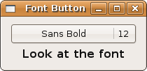
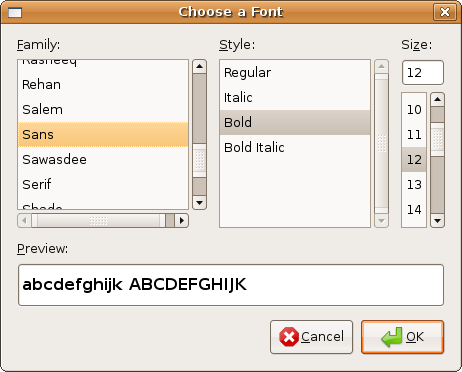

## 选择器接口和控件

### 字体按钮

Gtk::FontButton 是另一个特殊的按钮，用来选择已经安装的字体。像大多数按钮一样，它也是从 Gtk::Button 继承的，但是当点击时却发出特殊的信号，也就是 "font-set" 信号。让我们看看 Gtk::Button 树：

	Gtk::Button
	|   Gtk::ToggleButton
	|   |   Gtk::CheckButton
	|   |   |   Gtk::RadioButton
	|   Gtk::ColorButton
	|   Gtk::FontButton
	|   Gtk::LinkButton
	|   Gtk::OptionMenu
	|   Gtk::ScaleButton
	|   |   Gtk::VolumeButton

我们有两个文字按钮工具。第一个就是上面的按钮继承树里面的 Gtk::FontButton，也就是下面图里面的第一个。第二个是 Gtk::FontSelectionDialog 也就是当你点击 Gtk::FontButton 弹出的对话框。你可以在下面看到一个这样的例子。然而，你也不是非要使用文字按钮或者文字对话框控件才能操作文字，但它们是学习初始步骤的一个好的开始。文字选择器控件很多文字选项，你可以选择并且马上测试效果。这些选项包括：

+ 文字名字，也就是所谓的 Family
+ 文字样式
+ 大小

文字按钮控件是如下初始化的:

    font_button = Gtk::FontButton.new(font=nil)

font 参数需要一个如下格式的字符串: Family Style Size 的顺序。每个参数都是可选的，Gtk::FontButton 默认文字是 Sans 12 和没有样式。

Family 表示文字的名字，比如 "Sans", "Sherif" 或者 "Arial"。样式则可以在不同文字间通用，通常有 "Italic", "Bold", "Bold Italic" 和 "Regular" 几种。最后一个 "Regular" 就表示没有样式。size 则是像素大小，即 8, 9, 10 等等。

现在我们就来看看程序：

	#!/usr/bin/env ruby
	
	require 'gtk2'
	
	def font_changed(f_btt, label)
	  font = f_btt.font_name
	  desc = Pango::FontDescription.new(font)
	  label.text = "Font: %s" % [desc]
	  label.modify_font(desc)
	end
	
	window = Gtk::Window.new
	window.border_width = 10
	window.set_size_request(200, -1)
	window.title = "Font Button"
	
	window.signal_connect('delete_event') { false }
	window.signal_connect('destroy') { Gtk.main_quit }
	
	label = Gtk::Label.new("Look at the font")
	initial_font = Pango::FontDescription.new("Sans Bold 12")
	label.modify_font(initial_font)
	
	button = Gtk::FontButton.new(initial_font)
	button.title = "Choose a Font"
	
	button.signal_connect('font_set') { |w| font_changed(w, label) }
	
	vbox = Gtk::VBox.new(false, 5)
	vbox.pack_start_defaults(button)
	vbox.pack_start_defaults(label)
	
	window.add(vbox)
	window.show_all
	Gtk.main

理论上你可以在几乎所有控件中通过 Gtk::Widget#modify_font(font) 来修改字体，传递一个 Pango::FontDescription 实例作为参数。尽管目前（Ruby 1.8.6 和 Ruby-GNOME2）并不是这样，我们只能在 Gtk::Label 对象和像 Gtk::Entry 这样的可编辑对象上修改字体，而不能修改按钮文字或者按钮标签的字体。我相信将来这种情况会有所改变。对于哪些想去重新看看那个操作字体的程序并发现我说的问题的人，我建议你看看 [Fixed Containers]() 里面的三个短程序（包括注释）。

  + Pango::FontDescription.new(str = nil)
  
    用来创建一个文字 － 是一个 "[FAMILY-LIST] [STYLE-OPTIONS] [SIZE]" 格式的字符串。其中:
    
      + FAMILY-LIST 是一个逗号分隔并以逗号结尾的多个文字的组合字符串
      + STYLE_OPTIONS 是以空格分隔的多个单词的组合，每个单词分别表示了 style, variant, weight 或者 stretch
      + SIZE 是一个十进制数（像素为单位），任何参数都是可选的。
      
    如果没有 FAMILY-LIST, 最后的文字的 family_name 就会是 nil； 如果没有 STYLE-OPTIONS，他就会被设置为默认值；如果没有 SIZE，出来的字体大小就被设置为 0，如果 str 是 nil， 就表示所有属性都没有设置。
    
    这个方法返回一个 Pango::FontDescription 对象。
   
  + Gtk::Widget#modify_font(font_desc)
  
    设置控件的字体，(font_desc 是用来初始化 Pango::FontDescription)。所有其它的样式都未设置，详细请查阅 [Gtk::Widget#modify_style]()      

我们来看以下代码片段：

	# font = Pango::FontDescription.new("Monospace Bold 10")
	# font = Pango::FontDescription.new("Times,  Italic 20")
	# font = Pango::FontDescription.new("Comic Sans MS, Bold Italic 20")
	
	font = Pango::FontDescription.new("Nimbus Mono L, Bold Italic, 12")
	textview.modify_font(font)

 
 	