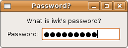
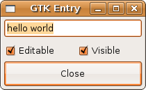

## 数字和文本输入

## 单行文本输入框

就像标题和上面的图片所示， Gtk::Entry 对象或者控件是一个单行自由格式的文本输入小控件。它可用于文本输入，密码输入甚至于数字选择。下一节中的 Gtk::SpinButton 就从它派生而出。Gtk::Entry 实现了 Gtk::Editable 接口（其中包含了获取文本输入的一些方法）。它还包含了一大堆信号用于绑定，和一些信号用于修改行为。还有一些功能是用于操作选中文本（高亮），删除或者插入字符（剪切或者粘贴）等等。

为了方便处理文本，你还需要知道很多属性。这里列出了一部分：

+ visibility
+ editable
+ invisible_char
+ text

等等。

你可以在 Gtk::Entry - 属性里面看到完整的列表。

	#!/usr/bin/env ruby
	require 'gtk2'
	
	# etc/Etc are Unix/Linux feature if you do not have this feature,
	# you should replace the [getlogin] below with something reasonable.
	#
	require 'etc'
	include Etc
	
	window = Gtk::Window.new(Gtk::Window::TOPLEVEL)
	window.set_title  "Password?"
	window.border_width = 10
	window.signal_connect('delete_event') { Gtk.main_quit }
	
	# Note "getlogin" is Unix/Linux feature if you do not have it,
	# you should replace the [getlogin] below with something reasonable.
	#
	question  = Gtk::Label.new("What is %s's password?" % [getlogin])
	entry_label = Gtk::Label.new("Password:")
	
	pass = Gtk::Entry.new
	pass.visibility = false
	
	# The following property takes integer value not string character
	# pass.invisible_char = 42           ### for instance 42=asterisk
	
	hbox = Gtk::HBox.new(false, 5)
	hbox.pack_start_defaults(entry_label)
	hbox.pack_start_defaults(pass)
	vbox = Gtk::VBox.new(false, 5)
	vbox.pack_start_defaults(question)
	vbox.pack_start_defaults(hbox)
	
	window.add(vbox)
	window.show_all
	Gtk.main

正如你所见，通过设置 visibility 属性，我们把输入对象变成了密码控件。然而我并没有设置 invisible_char 因为默认结果在我的系统里面还算可以接受。

下面一个是原始教程里面一个更复杂的例子：

你可以动态修改输入属性。如果你自己尝试一下可以更好的理解这段代码：

	#!/usr/bin/env ruby
	
	require 'gtk2'
	
	window = Gtk::Window.new
	window.set_size_request(200, 100)
	window.title = "GTK Entry"
	window.signal_connect("destroy") {Gtk.main_quit}
	
	vbox = Gtk::VBox.new(false, 0)
	window.add(vbox)
	
	entry = Gtk::Entry.new
	entry.max_length = 50
	entry.signal_connect("activate") {puts "Entry contents: #{entry.text}"}
	entry.text = "hello"
	entry.text += " world"
	entry.select_region(0, -1)
	vbox.pack_start(entry, true, true, 0)
	
	hbox = Gtk::HBox.new(false, 0)
	vbox.add(hbox)
	
	check = Gtk::CheckButton.new("Editable")
	check.signal_connect("toggled") {|w| entry.editable = w.active?}
	check.active = entry.editable?
	hbox.pack_start(check, true, true, 0)
	
	check = Gtk::CheckButton.new("Visible")
	check.signal_connect("toggled") {|w| entry.visibility = w.active?}
	check.active = entry.visibility?
	hbox.pack_start(check, true, true, 0)
	
	button = Gtk::Button.new("Close")
	button.signal_connect("clicked") {Gtk.main_quit}
	vbox.pack_start(button, true, true, 0)
	button.can_default = true
	button.grab_default
	
	window.show_all
	Gtk.main