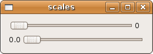
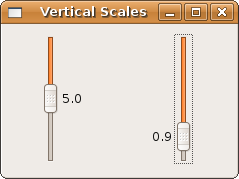

## 数值和文本输入

### 水平和垂直放大

#### 水平放大

如果你已经理解了之前旋转按钮章节里面的例子，你就应该能够理解下面的例子：

	#!/usr/bin/env ruby
	require 'gtk2'
	
	window = Gtk::Window.new(Gtk::Window::TOPLEVEL)
	window.set_title  "scales"
	window.border_width = 10
	window.signal_connect('delete_event') { Gtk.main_quit }
	window.set_size_request(250, -1)
	                           # min, max,  step
	integer = Gtk::HScale.new(0.0, 10.0, 1.0)
	float   = Gtk::HScale.new(0.0, 1.0,  0.1)
	integer.value_pos = Gtk::POS_RIGHT
	float.value_pos = Gtk::POS_LEFT
	
	vbox = Gtk::VBox.new(true, 5)
	vbox.pack_start(integer, false, true, 0)
	vbox.pack_start(float,   false, true, 0)
	
	window.add(vbox)
	window.show_all
	Gtk.main

#### 垂直放大

	

尽管使用了调整器，接下来的这个例子与你上面看到的几乎一样。要学习更多关于 Gtk::Adjustment 的例子，看看前一个章节中关于旋转按钮的讨论。

	require 'gtk2'
	
	window = Gtk::Window.new(Gtk::Window::TOPLEVEL)
	window.set_title  "Vertical Scales"
	window.border_width = 10
	window.signal_connect('delete_event') { Gtk.main_quit }
	window.set_size_request(-1, 150)
	
	# create two adjustments
	                            # value min, max, step  pg-incr pg-size
	int_adj   = Gtk::Adjustment.new(5.0, 0.0, 10.0, 1.0,  2.0,  0.0)
	float_adj = Gtk::Adjustment.new(0.5, 0.0, 1.0,  0.1, 0.5,   0.0)
	
	scale_int   = Gtk::VScale.new(int_adj)
	scale_float = Gtk::VScale.new(float_adj)
	scale_int.value_pos   = Gtk::POS_RIGHT
	scale_float.value_pos = Gtk::POS_LEFT
	
	hbox = Gtk::HBox.new(true, 5)
	hbox.pack_start_defaults(scale_int)
	hbox.pack_start_defaults(scale_float)
	
	window.add(hbox)
	window.show_all
	Gtk.main

#### GtkPositionType
  
  描述了一个特定功能是在放置在控件的哪一个边缘。比如说，Gtk::Notebook 的标签，Gtk::HandleBox 的把手，Gtk::Scale 的标签文本
  
   + POS_LEFT - 表示放置在左边缘
   + POS_RIGHT - 表示放置在右边缘
   + POS_TOP - 表示放置在上边缘
   + POS_BOTTOM - 表示放置在下边缘