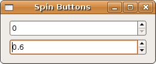
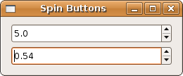
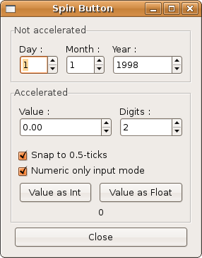

## 数值和文本输入

### 旋转按钮

+ 调整器

Gtk::SpinButton 控件是一个数字选择控件，既可以用来获取整数，也可以用来获取浮点数。它从 Gtk::Entry 控件派生而来，所以继承了它的所有功能和信号。尽管起初并不需要，但是为了更好地了解旋转按钮，最好也了解一下另一个类：也就是 Gtk::Adjustment。在下面的例子中，我们并不直接操作 Gtk::Adjustment 类。让我们仔细看看这段程序并尝试理解它。之后我们会把它切分开，你就可以看到这两者的关系。

	#!/usr/bin/env ruby
	
	require 'gtk2'
	
	window = Gtk::Window.new(Gtk::Window::TOPLEVEL)
	window.set_title  "Spin Buttons"
	window.border_width = 10
	window.signal_connect('delete_event') { Gtk.main_quit }
	window.set_size_request(250, -1)
	
	                           # min, max,  step
	integer = Gtk::SpinButton.new(0.0, 10.0, 1.0)
	float   = Gtk::SpinButton.new(0.0, 1.0,  0.1)
	
	vbox = Gtk::VBox.new(false, 5)
	vbox.pack_start(integer, false, true, 0)
	vbox.pack_start(float,   false, true, 0)
	
	window.add(vbox)
	window.show_all
	Gtk.main

看过上面的例子，你就知道我们可以通过上下三角箭头来增减数值。同时，也可以通过键盘输入，如果值超出范围，就会被设置为离它最近的有效值。

接下来的例子和上面的一样，只是用调整器代替。同时，我把浮点数的精度调整到 0.01。使用调整器的主要区别现在还没有体现出来。首先，你可以指定一个初始值，然后可以用 Page Up/Down 来做更大幅度的调整。

	#!/usr/bin/env ruby
	require 'gtk2'
	
	window = Gtk::Window.new(Gtk::Window::TOPLEVEL)
	window.set_title  "Spin Buttons"
	window.border_width = 10
	window.signal_connect('delete_event') { Gtk.main_quit }
	window.set_size_request(250, -1)
	
	# create two adjustments
	                            # value min, max, step  pg-incr pg-size
	integer = Gtk::Adjustment.new(5.0, 0.0, 10.0, 1.0,  2.0,    2.0)
	float   = Gtk::Adjustment.new(0.5, 0.0, 1.0,  0.01, 0.5,    0.5)
	
	spin_int   = Gtk::SpinButton.new(integer, 1.0, 1)
	spin_float = Gtk::SpinButton.new(float,   0.01, 2)
	
	vbox = Gtk::VBox.new(false, 5)
	vbox.pack_start(spin_int,   false, true, 0)
	vbox.pack_start(spin_float, false, true, 0)
	
	window.add(vbox)
	window.show_all
	Gtk.main

### 调整器

因为它从 Gtk::Object 派生而来，Gtk::Adjustment GTK+ 中少数几个不是控件的类。它常常用在很多控件中，比如视图，从 Gtk::Range 派生出来的控件，放大器或者旋转按钮。

  创建一个调整器需要6个参数:
  
    + initial value
    + lower range
    + upper range
    + step increment
    + page increment
    + page size
   
   也有两个用于此类的信号:
   
    + changed － 除了值以外的其它属性修改触发
    + value-changed － 值更新时触发

### 下面是日版教程里面一个更加详细的例子

    

	#!/usr/bin/env ruby
	require 'gtk2'
	
	def get_value(spin, label, type)
		label.set_text(
			case type
			when :Int
				"%d" % spin.value
			when :Float
				"%0.*f" % [spin.digits, spin.value]
			else
				"0"
			end
		)
	end
	
	window = Gtk::Window.new
	window.signal_connect("destroy") {Gtk.main_quit}
	window.title = "Spin Button"
	
	main_vbox = Gtk::VBox.new(false, 5)
	main_vbox.border_width = 10
	window.add(main_vbox)
	
	frame = Gtk::Frame.new("Not accelerated")
	main_vbox.pack_start(frame, true, true, 0)
	
	vbox = Gtk::VBox.new(false, 0)
	vbox.border_width = 5
	frame.add(vbox)
	
	hbox = Gtk::HBox.new(false, 0)
	vbox.pack_start(hbox, true, true, 5)
	
	vbox2 = Gtk::VBox.new(false, 0)
	hbox.pack_start(vbox2, true, true, 5)
	
	label = Gtk::Label.new("Day :")
	label.set_alignment(0, 0.5)
	vbox2.pack_start(label, false, true, 0)
	
	adj = Gtk::Adjustment.new(1.0, 1.0, 31.0, 1.0, 5.0, 0.0)
	
	spinner = Gtk::SpinButton.new(adj, 0, 0)
	spinner.wrap = true
	#spinner.shadow_type = Gtk::SHADOW_OUT
	vbox2.pack_start(spinner, false, true, 0)
	
	vbox2 = Gtk::VBox.new(false, 0)
	hbox.pack_start(vbox2, true, true, 5)
	
	label = Gtk::Label.new("Month :")
	label.set_alignment(0, 0.5)
	vbox2.pack_start(label, false, true, 0)
	
	adj = Gtk::Adjustment.new(1.0, 1.0, 12.0, 1.0, 5.0, 0.0)
	
	spinner = Gtk::SpinButton.new(adj, 0, 0)
	spinner.wrap = true
	#spinner.shadow_type = Gtk::SHADOW_ETCHED_IN
	vbox2.pack_start(spinner, false, true, 0)
	
	vbox2 = Gtk::VBox.new(false, 0)
	hbox.pack_start(vbox2, true, true, 5)
	
	label = Gtk::Label.new("Year :")
	label.set_alignment(0, 0.5)
	vbox2.pack_start(label, false, true, 0)
	
	adj = Gtk::Adjustment.new(1998.0, 0.0, 2100.0, 1.0, 100.0, 0.0)
	
	spinner = Gtk::SpinButton.new(adj, 0, 0)
	spinner.wrap = true
	#spinner.shadow_type = Gtk::SHADOW_IN
	spinner.set_size_request(55, -1)
	vbox2.pack_start(spinner, false, true, 0)
	
	frame = Gtk::Frame.new("Accelerated")
	main_vbox.pack_start(frame, true, true, 0)
	
	vbox = Gtk::VBox.new(false, 0)
	vbox.border_width = 5
	frame.add(vbox)
	
	hbox = Gtk::HBox.new(false, 0)
	vbox.pack_start(hbox, false, true, 5)
	
	vbox2 = Gtk::VBox.new(false, 0)
	hbox.pack_start(vbox2, true, true, 5)
	
	label = Gtk::Label.new("Value :")
	label.set_alignment(0, 0.5)
	vbox2.pack_start(label, false, true, 0)
	
	adj = Gtk::Adjustment.new(0.0, -10000.0, 10000.0, 0.5, 100.0, 0.0)
	
	spinner1 = Gtk::SpinButton.new(adj, 1.0, 2)
	spinner.wrap = true
	spinner.set_size_request(100, -1)
	vbox2.pack_start(spinner1, false, true, 0)
	
	vbox2 = Gtk::VBox.new(false, 0)
	hbox.pack_start(vbox2, true, true, 5)
	
	label = Gtk::Label.new("Digits :")
	label.set_alignment(0, 0.5)
	vbox2.pack_start(label, false, true, 0)
	
	adj = Gtk::Adjustment.new(2, 1, 5, 1, 1, 0)
	spinner2 = Gtk::SpinButton.new(adj, 0.0, 0)
	spinner2.wrap = true
	spinner2.signal_connect("value_changed") do |w|
		spinner1.digits = w.value
	end
	vbox2.pack_start(spinner2, false, true, 0)
	
	hbox = Gtk::HBox.new(false, 0)
	vbox.pack_start(hbox, false, true, 5)
	
	button = Gtk::CheckButton.new("Snap to 0.5-ticks")
	button.signal_connect("clicked") do |w|
		spinner1.snap_to_ticks = w.active?
	end
	vbox.pack_start(button, true, true, 0)
	button.active = true
	
	button = Gtk::CheckButton.new("Numeric only input mode")
	button.signal_connect("clicked") do |w|
		spinner1.numeric = w.active?
	end
	vbox.pack_start(button, true, true, 0)
	button.active = true
	
	val_label = Gtk::Label.new 
	
	hbox = Gtk::HBox.new(false, 0)
	vbox.pack_start(hbox, false, true, 5)
	button = Gtk::Button.new("Value as Int")
	button.signal_connect("clicked") do
		get_value(spinner1, val_label, :Int)
	end
	hbox.pack_start(button, true, true, 5)
	
	button = Gtk::Button.new("Value as Float")
	button.signal_connect("clicked") do
		get_value(spinner1, val_label, :Float)
	end
	hbox.pack_start(button, true, true, 5)
	
	vbox.pack_start(val_label, true, true, 0)
	val_label.set_text("0")
	
	hbox = Gtk::HBox.new(false, 0)
	main_vbox.pack_start(hbox, false, true, 0)
	
	button = Gtk::Button.new("Close")
	button.signal_connect("clicked") {window.destroy}
	hbox.pack_start(button, true, true, 5)
	
	window.show_all
	Gtk.main

	