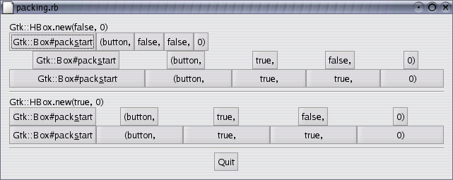
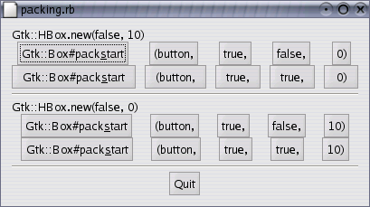

## 关于这个盒子

因为灵活，刚开始接触 GTK 里面包装盒子会感觉很迷惑。它们有一堆的选项，但又不知道是如何协作的。基本上，它们有五种基本模式。

每一行都包含了一个水平盒子（hbox）和几个按钮。注意，Gtk::Box#pack 是把很多按钮放置到水平盒子里面的一种简写。每个按钮都是用相同的方式来放置的（比如说，都使用相同的参数调用 Gtk::Box#pack_start ）。

Gtk::Box#pack_start 方法各参数看起来是这样的：

    Gtk::Box#pack_start(child, expand, fill, padding)

第一个参数是你要放置到盒子里面的对象。在这里这个对象都是按钮，也就是说我们把按钮放置到盒子里面。

expand 参数是用于说明控件是如何布局的。

  + expand 为 true
  
    控件会填满盒子里面额外的空间，所以盒子会自动扩大来填满分配给它的空间
    
  + expand 为 false
  
    盒子会压缩到刚刚好包含控件

把 expand 设为 false 让你可以左右对齐你的控件。反之，它们则会填满整个盒子的空间，Gtk::Box#pack_start 和 Gtk::Box#pack_end 均是如此。

fill 参数则控制 expand 参数分配到的空间放到对象什么位置

  + fill 为 true
  
    把对象扩大来占满分配的空间
    
  + fill 为 false
  
    保持对象大小不变，周边用合适的空白填充
    
注意， fill 参数只有在 expand 参数为 true 才有效

再来看创建一个水平盒子时：

	Gtk::HBox.new(homogeneous, spacing)

Gtk::HBox.new 的 homogeneous 参数（Gtk::VBox.new 也一样）是控制盒子里的每个对象是不是一样大小（比如说，水平盒子里面一样的宽度，垂直盒子里面一样的高度）。如果这个参数设为 true，就相当于 Gtk::Box#pack_start 和 Gtk::Box#pack_end 方法的 expand 参数一直都是 true。

spacing (创建盒子时候设置的) 和 padding (打包元素的时候设置的) 有什么区别？ spacing 是对象之间的空间，而 padding 是添加到一个对象的某一侧的。下面的截图可以帮助理解：

接下来是创建以上截图的代码。它们都加了很多注释来便于理解，所以我希望你不会碰上什么麻烦。享受吧。